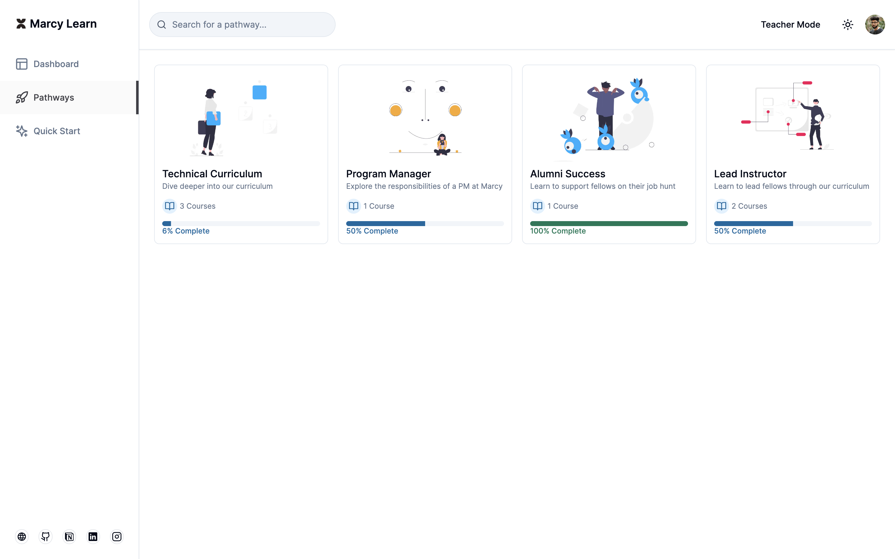
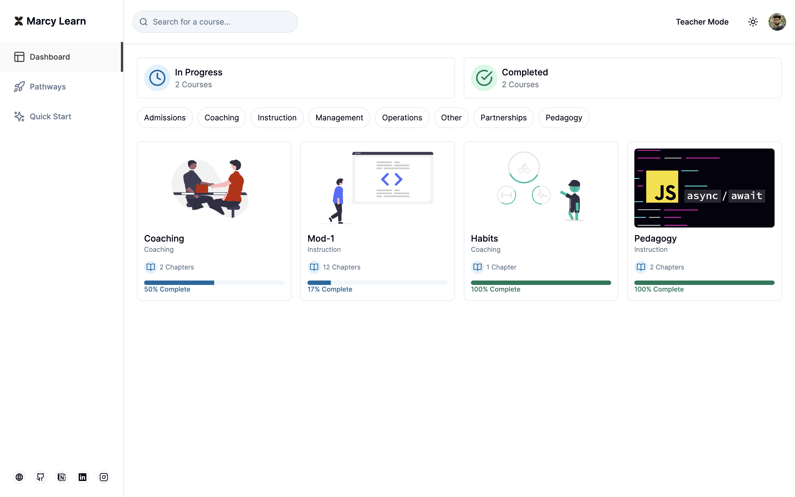
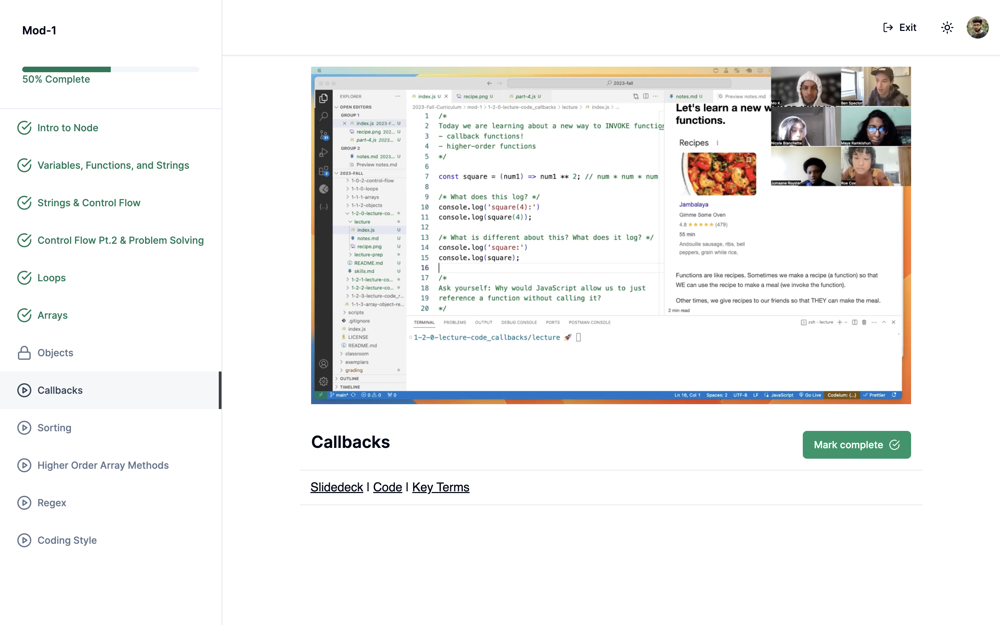

# Marcy Learn

A full-stack web application making company-wide learning management and onboarding easier via internal courses, learning pathways, and an admin dashboard. Tech Stack - TypeScript, React, Next.js, Prisma, and PostgreSQL. [Live Link](https://bit.ly/marcy-learn)
  

 

### Functionality

Marcy Learn allows a user to 
- Browse & Filter Courses and Pathways
- Track Progress for Courses and Pathways
- Student Dashboard 
- Teacher Mode

### Demo 

#### Learning Pathways
 

#### Learner Dashboard 
 

#### Course Chapter
 

### Technologies Used
- TypeScript
- React
- Next.js
- Prisma
- Supabase
- Clerk
- Mux Data 
- Upload Thing 

